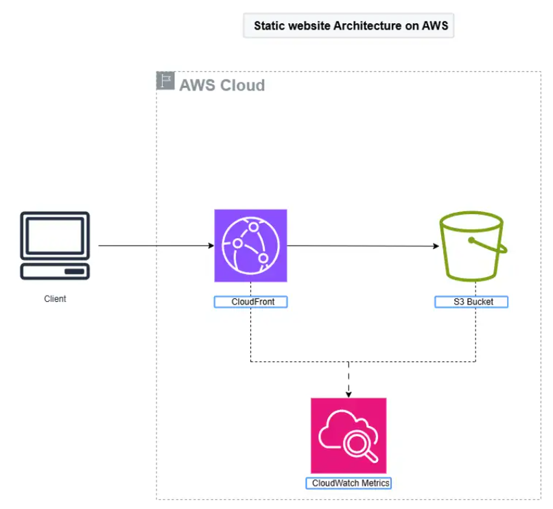

# Creating a Personal Website using AWS Services

This repository demonstrates how to create and host a personal website using AWS services. Follow the steps below to set up your website, leveraging AWS tools and services like S3, CloudFront, and CloudWatch.

## Table of Contents

- [Creating a Personal Website using AWS Services](#creating-a-personal-website-using-aws-services)
  - [Table of Contents](#table-of-contents)
  - [Project Overview](#project-overview)
  - [Architecture Diagram](#architecture-diagram)
  - [AWS Services Used](#aws-services-used)
  - [Prerequisites](#prerequisites)
  - [Step-by-Step Guide](#step-by-step-guide)
    - [1. Create and Configure an S3 Bucket](#1-create-and-configure-an-s3-bucket)
    - [2. Upload Website Files](#2-upload-website-files)
    - [3. Configure CloudFront for Content Delivery](#3-configure-cloudfront-for-content-delivery)
    - [4. Deploy Your Website Files](#4-deploy-your-website-files)
    - [6. Deleting All AWS Resources](#6-deleting-all-aws-resources)
      - [1. Delete CloudFront Distribution](#1-delete-cloudfront-distribution)
- [Disable the CloudFront distribution (change DistributionId to your actual ID)](#disable-the-cloudfront-distribution-change-distributionid-to-your-actual-id)
- [Wait for the distribution to be fully disabled (takes some time)](#wait-for-the-distribution-to-be-fully-disabled-takes-some-time)
- [Now delete the CloudFront distribution](#now-delete-the-cloudfront-distribution)
- [Remove all objects from the S3 bucket](#remove-all-objects-from-the-s3-bucket)
- [Delete the S3 bucket](#delete-the-s3-bucket)

---

## Project Overview

This project showcases how to deploy a personal website on AWS using a serverless architecture. The website will be:

- **Highly available**: AWS S3 and CloudFront ensure reliability.

## Architecture Diagram




## AWS Services Used

- **Amazon S3**: For static website hosting.
- **Amazon CloudFront**: For caching and content delivery.
- **Amazon CloudWatch**: For monitoring and observability.


## Prerequisites

- An AWS account.
- Website files (HTML, CSS, JavaScript, and assets).

## Step-by-Step Guide

### 1. Create and Configure an S3 Bucket

To create and configure an S3 bucket for hosting your website:

```bash
# Create an S3 bucket in the N. Virginia region (ensure the bucket name is unique globally)
aws s3api create-bucket --bucket my-unique-bucket-name --region us-east-1 --create-bucket-configuration LocationConstraint=us-east-1

# Verify public access block settings (Block all public access should be enabled by default)
aws s3api get-bucket-policy-status --bucket my-unique-bucket-name

# If not enabled, block public access
aws s3api put-public-access-block --bucket my-unique-bucket-name --public-access-block-configuration \
BlockPublicAcls=true \
IgnorePublicAcls=true \
BlockPublicPolicy=true \
RestrictPublicBuckets=true
```

### 2. Upload Website Files

Once your S3 bucket is created, upload your website files:

```bash
# Upload individual files
aws s3 cp index.html s3://my-unique-bucket-name/
aws s3 cp index.css s3://my-unique-bucket-name/
aws s3 cp avatar.png s3://my-unique-bucket-name/

# Alternatively, upload all files in a directory
aws s3 cp . s3://my-unique-bucket-name/ --recursive
```

### 3. Configure CloudFront for Content Delivery

To configure CloudFront for content delivery, follow these steps:

1. **Create an Origin Access Control (OAC)** to restrict access to the S3 bucket:

    ```bash
    aws cloudfront create-origin-access-control \
        --name "MyOAC" \
        --origin-access-control-config '{"SigningBehavior": "never", "SigningProtocol": "none"}'
    ```

2. **Get the OAC ID**:

    ```bash
    OAC_ID=$(aws cloudfront list-origin-access-controls --query "OriginAccessControlList.Items[0].Id" --output text)
    ```

3. **Create the CloudFront distribution**:

    ```bash
    aws cloudfront create-distribution \
        --distribution-config '{
            "CallerReference": "unique-reference-id",
            "Origins": {
                "Items": [
                    {
                        "Id": "S3-MyUniqueBucketName",
                        "DomainName": "my-unique-bucket-name.s3.amazonaws.com",
                        "S3OriginConfig": {
                            "OriginAccessControlId": "'"$OAC_ID"'"
                        }
                    }
                ],
                "Quantity": 1
            },
            "DefaultCacheBehavior": {
                "TargetOriginId": "S3-MyUniqueBucketName",
                "ViewerProtocolPolicy": "redirect-to-https",
                "AllowedMethods": {
                    "Quantity": 2,
                    "Items": ["GET", "HEAD"]
                },
                "CachedMethods": {
                    "Quantity": 2,
                    "Items": ["GET", "HEAD"]
                }
            },
            "Enabled": true,
            "WebACLId": ""  # No WAF enabled
        }'
    ```

4. **Update S3 Bucket Policy** to allow CloudFront to access the S3 objects:

    ```bash
    aws s3api put-bucket-policy --bucket my-unique-bucket-name --policy '{
        "Version": "2012-10-17",
        "Statement": [
            {
                "Sid": "CloudFrontOACPolicy",
                "Effect": "Allow",
                "Principal": "*",
                "Action": "s3:GetObject",
                "Resource": "arn:aws:s3:::my-unique-bucket-name/*",
                "Condition": {
                    "StringEquals": {
                        "AWS:SourceArn": "arn:aws:cloudfront::$AWS_ACCOUNT_ID:distribution/$CF_DISTRIBUTION_ID"
                    }
                }
            }
        ]
    }'
    ```

5. **Optional: Update S3 Bucket ACL** (if required):

    ```bash
    aws s3api put-bucket-acl --bucket my-unique-bucket-name --grant-read 'uri="http://acs.amazonaws.com/groups/global/AllUsers"'
    ```

6. **Retrieve the CloudFront distribution ID** (optional):

    ```bash
    CF_DISTRIBUTION_ID=$(aws cloudfront list-distributions --query "DistributionList.Items[0].Id" --output text)
    echo "CloudFront Distribution created with ID: $CF_DISTRIBUTION_ID"
    ```

These commands will update your S3 bucket's permissions and ACL to allow CloudFront to access the objects for delivery.

### 4. Deploy Your Website Files

After creating and configuring your CloudFront distribution, you can access the website using the CloudFront distribution domain. Follow these steps:

1. **Get the CloudFront Distribution URL** to access the `index.html` file:

    ```bash
    # Get the CloudFront distribution domain name
    CF_DISTRIBUTION_DOMAIN=$(aws cloudfront list-distributions --query "DistributionList.Items[0].DomainName" --output text)

    # Print the URL for the index.html file
    echo "Your CloudFront URL: http://$CF_DISTRIBUTION_DOMAIN/index.html"
    ```

    This command retrieves the CloudFront distribution domain name and appends `/index.html` to form the URL for accessing your website's landing page.

2. **Access the Website**: You can now visit the URL provided (e.g., `http://d123abc456def.cloudfront.net/index.html`) to see your deployed website.

3. **Verify**: Ensure the website is loading as expected by navigating to the CloudFront URL in a browser.

### 6. Deleting All AWS Resources

After you have finished with your AWS resources, you can delete them to avoid any unnecessary costs. Below are the steps to delete the resources you created:

#### 1. Delete CloudFront Distribution

To delete the CloudFront distribution, follow these steps:

```bash
# Disable the CloudFront distribution (change DistributionId to your actual ID)
aws cloudfront update-distribution --id <DISTRIBUTION_ID> --distribution-config file://disable-distribution.json

# Wait for the distribution to be fully disabled (takes some time)
aws cloudfront wait distribution-inactive --id <DISTRIBUTION_ID>

# Now delete the CloudFront distribution
aws cloudfront delete-distribution --id <DISTRIBUTION_ID> --if-match <ETAG>

aws cloudfront list-distributions


# Remove all objects from the S3 bucket
aws s3 rm s3://my-unique-bucket-name --recursive

# Delete the S3 bucket
aws s3api delete-bucket --bucket my-unique-bucket-name --region us-east-1


